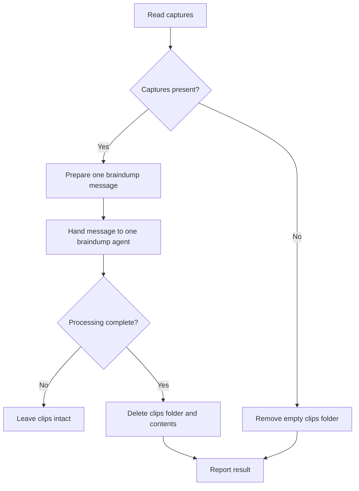

# COG clipping adapter

## Input

- Locate the installed `braindump/SKILL.md` in these current workspace directories:
  `.agents/skills/`, `.claude/skills/`, `skills/`.
- Read `title`, `source_url` and `reason` from every pending `00-inbox/clips/*/capture.json`.
- Prepare one plain-text message for `braindump` using this format:

```text
I need to braindump.

- {title}: {source_url}
  {reason}

- {title}: {source_url}
  {reason}
```

- Include your note unchanged.

## Handover

- Delegate the prepared message to one separate `braindump` agent.
- Start that `braindump` agent without inheriting this adapter conversation.
- Provide the discovered `braindump/SKILL.md` path alongside the prepared message.
- Tell that agent to follow the `braindump` skill completely.
- Wait for the `braindump` agent to finish processing everything.

## Cleanup

- Delete `00-inbox/clips/` and all its contents after `braindump` completes.
- Remove an empty `00-inbox/clips/` folder without starting a worker.
- Report the `braindump` result, or report no pending clips.

## Boundaries

*Stop if either `braindump/SKILL.md` or agent delegation is unavailable.*
*Create no tracking files while processing captures through `process-clips`.*
*Keep `00-inbox/clips/` intact if processing is interrupted or awaiting input.*
Use one agent to run braindump for all clippings. That agent must not create other agents.
*Never modify the `braindump` skill or its output files.*

## Workflow



## Metadata

Codex `display_name` and invocation settings: [metadata](agents/openai.yaml).
